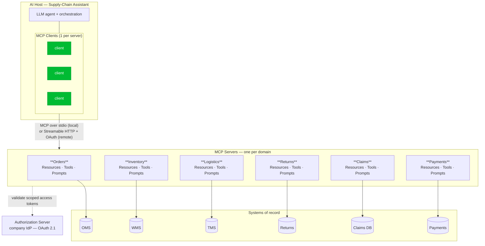
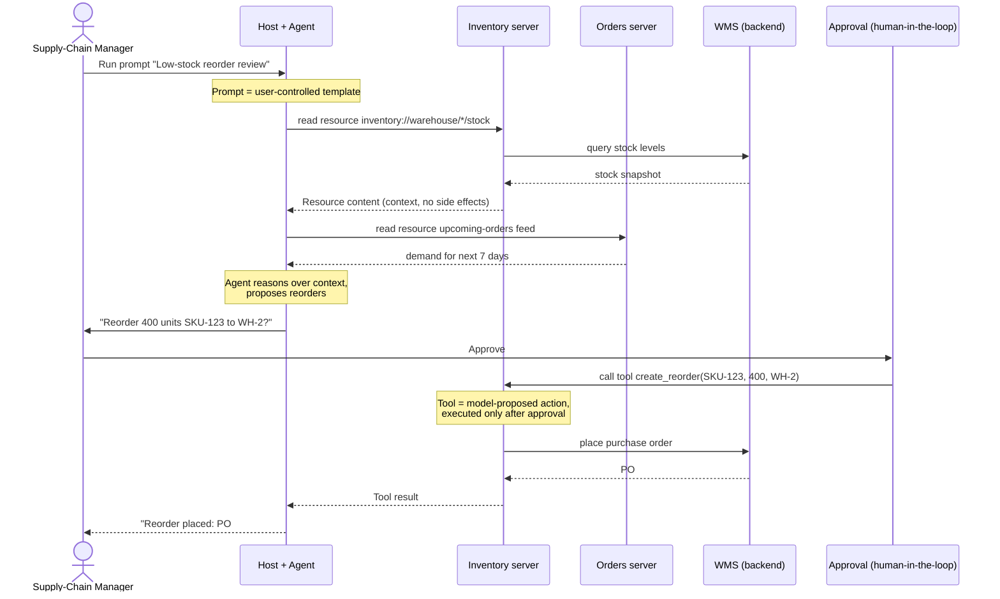
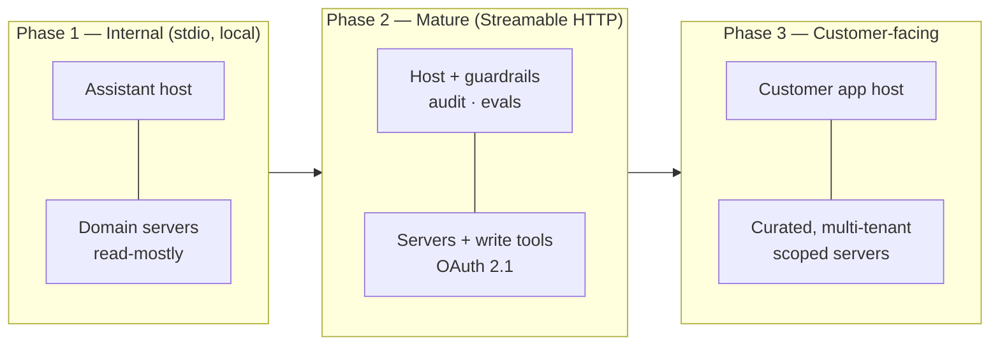

# Architecture

The system has three layers: a **host** running the AI agent, one **MCP client** per connection, and a set of **MCP servers** — one per business domain — each fronting a real backend system. Capabilities are expressed as **Resources** (read context), **Tools** (actions), and **Prompts** (workflows).

## One server per bounded context

Each operational system the supply-chain manager relies on is wrapped by a dedicated MCP server. This keeps credentials, scopes, and blast radius isolated per domain (see [Security](security.md)).

| MCP server | Fronts | Resources (read) | Tools (act) | Prompts |
| --- | --- | --- | --- | --- |
| **Orders** | Order Mgmt System (OMS) | `orders://order/{id}`, upcoming-orders feed | `flag_order`, `split_shipment` | "Late-shipment investigation" |
| **Inventory** | Warehouse Mgmt (WMS) | `inventory://warehouse/{id}/stock` | `create_reorder`, `transfer_stock` | "Low-stock reorder review" |
| **Logistics** | Transport Mgmt (TMS) | `drivers://roster/{region}`, route status | `reroute_driver`, `assign_driver` | "Re-plan a delayed route" |
| **Returns** | Returns/RMA service | `returns://rma/{id}`, returns policy | `approve_return`, `issue_label` | "High-value return approval" |
| **Claims** | Claims service | `claims://claim/{id}` | `open_claim`, `escalate_claim` | "Triage damage claims" |
| **Payments** | Payments/settlement | `payments://order/{id}/status` | `release_hold` *(restricted)* | "Settlement exceptions" |

## System overview

The host speaks MCP to each server through its own client. Locally (Phase 1) servers run as subprocesses over **stdio**; remotely (Phase 2–3) they run as services over **Streamable HTTP** with OAuth 2.1. Each server is the single enforcement point in front of its system of record.

## Tools / Resources / Prompts in flow

A representative workflow — the manager runs the **"Low-stock reorder review"** prompt during the morning briefing:

**Why this split matters:**

- **Resources** are read-only and **application-controlled** — the host decides what context to pull in; they never mutate state, so they're safe to fetch liberally.
- **Tools** are **model-proposed** but, for any side-effecting action, **human-approved**. The agent suggests `create_reorder`; a person authorizes it. High-impact tools (e.g. Payments `release_hold`) are restricted by scope regardless.
- **Prompts** are **user-controlled** workflows surfaced as slash-commands, encoding best-practice operating procedures so results are consistent across operators.

## Phase evolution

- **Phase 1** — servers run locally beside the host over stdio; the manager gets grounded answers and approves every action.
- **Phase 2** — servers are deployed as remote services with OAuth 2.1, write tools enabled behind guardrails, with full audit and evaluation.
- **Phase 3** — a curated subset (order tracking, returns initiation) is exposed to the customer experience, with per-customer (multi-tenant) isolation enforced server-side.

See **[Implementation](implementation.md)** for how a server like Inventory is actually built, and **[Security](security.md)** for the authorization and transport model behind these phases.
