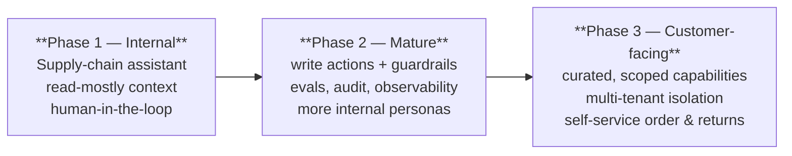

# MCP for E-Commerce — Business-Context AI Agents

A proof of concept that gives an e-commerce company's AI agents the **business context they need to actually run operations** — live orders, inventory, logistics, returns, claims, and payments — using the **Model Context Protocol (MCP)**.

The PoC follows a deliberate maturity path: **prove value internally** with a supply-chain assistant, **harden it**, then **extend curated capabilities to customers**.

## What MCP is

The [Model Context Protocol](https://modelcontextprotocol.io) is an open standard that connects AI applications to external systems through a uniform interface — often described as *"a USB-C port for AI applications."* Instead of writing a bespoke integration for every model–system pair, you expose each system once as an **MCP server**, and any **MCP-capable client** (Claude, an IDE, a custom agent host) can use it.

MCP defines three server-provided primitives:

| Primitive | Controlled by | Analogy | In this PoC |
| --- | --- | --- | --- |
| **Resources** | Application | A GET request — read-only context, no side effects | An order record, a warehouse stock snapshot, the returns policy |
| **Tools** | Model | A function call — performs actions, may have side effects | Create a reorder, reroute a driver, approve a return |
| **Prompts** | User | A reusable template / slash-command | "Daily supply-chain briefing", "Investigate a late shipment" |

## Why it matters for AI-agent integration

Without a protocol, every new data source or action is a one-off integration — an **N×M problem** between models and systems that doesn't scale and rots quickly. MCP turns that into **N + M**: build a server per system, and every agent reuses it.

- **Context over guesswork.** A general LLM has no idea that *order #88213 is 2 days late because its assigned driver called in sick*. MCP feeds the agent governed, real-time business data so its answers and actions are grounded in fact.
- **Actions, not just chat.** Tools let the agent *do* things — place a reorder, reroute a delivery — under explicit authorization and human approval, not just describe them.
- **Decoupled and reusable.** The same Inventory server powers the internal supply-chain assistant *and*, later, the customer "where's my order?" experience. Build once, govern centrally, reuse everywhere.
- **Governed by design.** Every capability is scoped, authorized, and audited at the server — the natural place to enforce least privilege (see [Security](security.md)).

## The scenario

**An Amazon-style e-commerce company (smaller scale)** wants its internal AI applications to be genuinely useful to operators before exposing anything to customers.

The first persona is a **Supply-Chain Manager** who needs a single agent with governed access to everything involved in running fulfilment:

> upcoming customer orders · inventory across warehouses · in-flight deliveries and drivers · returns and RMAs · damage claims · payment and settlement status

### Maturity journey

1. **Internal first** — give the supply-chain manager an assistant that reads orders/inventory/logistics as **Resources** and proposes actions; every side-effecting **Tool** call requires human approval.
2. **Mature** — enable trusted write actions behind guardrails, add evaluation and full audit logging, and onboard more internal roles (warehouse lead, returns specialist).
3. **Customer-facing** — expose a tightly-scoped subset (order tracking, returns initiation) into the customer digital experience, with per-customer isolation and stricter authorization.

## Read next

- **[Architecture](architecture.md)** — the MCP servers, clients, and the Tools/Resources/Prompts flow for this scenario (with diagrams).
- **[Implementation](implementation.md)** — how the servers and clients are built (Python MCP SDK).
- **[Security](security.md)** — authorization, scoped access, and transport hardening across the three phases.

!!! note "Status"
    This is a **design-led proof of concept**: the architecture, code patterns, and security model are production-shaped and standards-accurate, illustrated against a representative e-commerce domain rather than a specific company's systems.
