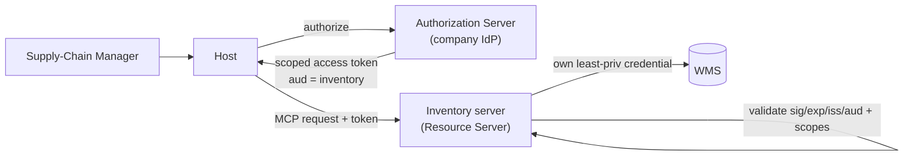

# Security

The agent can read business data and trigger real actions — reorders, reroutes, refunds — so security is the core of the design, not an afterthought. Controls are layered: **authorization** at the edge, **scoped access** per capability, **transport hardening** per phase, and mitigations for **MCP-specific risks**.

## Authorization

Remote MCP servers (Phase 2–3) follow the **MCP authorization spec**, which builds on **OAuth 2.1**. Each MCP server acts as an **OAuth Resource Server**; the company identity provider (Okta / Entra / Auth0) is the **Authorization Server**.

- **Bearer access tokens** — the host obtains a token for the user and presents it on every request; the server validates signature, expiry, issuer, and **audience** before serving anything.
- **Audience binding** — tokens are issued *for a specific MCP server* and rejected elsewhere, so a token for the Inventory server can't be replayed against Payments.
- **No token pass-through** — a server never forwards the caller's token to its backend. It exchanges identity for its own least-privilege backend credential. (Pass-through is an explicit MCP anti-pattern — it turns a server into a confused deputy.)
- **Local phase** — Phase 1 stdio servers run as the user's own subprocess with no network surface, so they inherit the user's local trust boundary; OAuth applies once servers go remote.



## Scoped access

Authorization is necessary but not sufficient — **what** a token can do is bounded by scopes mapped from the user's role (RBAC).

- **Per-capability scopes.** Resources and tools require scopes, e.g. `inventory:read`, `inventory:reorder`, `payments:read`. The supply-chain manager holds read across domains plus `inventory:reorder` and `logistics:reroute`, but **not** `payments:release` — that stays with finance.
- **Least privilege per server.** Each server fronts exactly one system and holds only that system's credential. Compromising the Returns server cannot touch payments or the WMS.
- **Approval for side effects.** Independent of scope, side-effecting tools require human approval in the host; high-impact tools are additionally scope-restricted.
- **Server-side enforcement of data boundaries.** Filtering is never delegated to the model. For the customer phase, every query is constrained to the authenticated tenant **in the server**:

```python
@mcp.tool()
def my_orders(status: str = "open", ctx: Context = None) -> str:
    customer_id = ctx.auth.claims["sub"]          # from the validated token
    return oms.list_orders(customer=customer_id,  # scope enforced server-side
                           status=status)         # model cannot widen this
```

- **Multi-tenant isolation (Phase 3).** Customer-facing servers scope every read/write to the caller's tenant (row-level), so one customer can never see another's orders, returns, or payments — enforced by the token's identity, not by prompt instructions.

## Transport hardening

| Phase | Transport | Hardening |
| --- | --- | --- |
| 1 — Internal | **stdio** (local subprocess) | No network listener; runs in the user's trust boundary; servers are pinned to known local files |
| 2 — Mature | **Streamable HTTP** | TLS only; OAuth 2.1; **Origin header validation** to block DNS-rebinding; bind to localhost when not public; session IDs; request size/rate limits |
| 3 — Customer | **Streamable HTTP** behind gateway | All of Phase 2 + WAF, per-tenant rate limiting, network segmentation between servers and systems of record |

Key rules:

- **TLS everywhere** for remote transports; never expose stdio over a network.
- **Validate `Origin`** on every HTTP request to prevent DNS-rebinding attacks against locally-bound servers, and bind to `127.0.0.1` rather than `0.0.0.0` unless the server is intentionally public.
- **Rate-limit and size-limit** requests; assign and verify session IDs.
- **Audit every tool call** — who, which tool, arguments, approval, result — to an append-only log. This is both a security control and the evidence trail operations needs.

## MCP-specific risks

- **Prompt injection / tool poisoning.** Resource content (an order note, a return reason) and third-party tool descriptions are untrusted input. Only connect **pinned, trusted servers**; treat fetched content as data, not instructions; and keep side-effecting tools behind human approval so an injected "issue a refund" can't auto-execute.
- **Confused deputy.** Avoided by per-server least-privilege credentials, audience-bound tokens, and no token pass-through.
- **Over-broad tools.** Tools are narrow and typed (`create_reorder(sku, quantity, warehouse)`), not a generic "run this query," limiting what a manipulated agent can express.
- **Secret hygiene.** Backend credentials live in a secrets manager and are injected at runtime; nothing sensitive is committed. `.env`, keys, and build output are git-ignored.

## Posture summary

| Control | Phase 1 | Phase 2 | Phase 3 |
| --- | --- | --- | --- |
| OAuth 2.1 authorization | local trust | **enforced** | **enforced** |
| Role → scope (RBAC) | basic | **enforced** | **enforced** |
| Human approval for side effects | **enforced** | **enforced** | **enforced** |
| Least-privilege per-server credentials | **enforced** | **enforced** | **enforced** |
| TLS + Origin validation | n/a (stdio) | **enforced** | **enforced** |
| Per-tenant isolation | n/a | n/a | **enforced** |
| Audit logging of tool calls | recommended | **enforced** | **enforced** |
